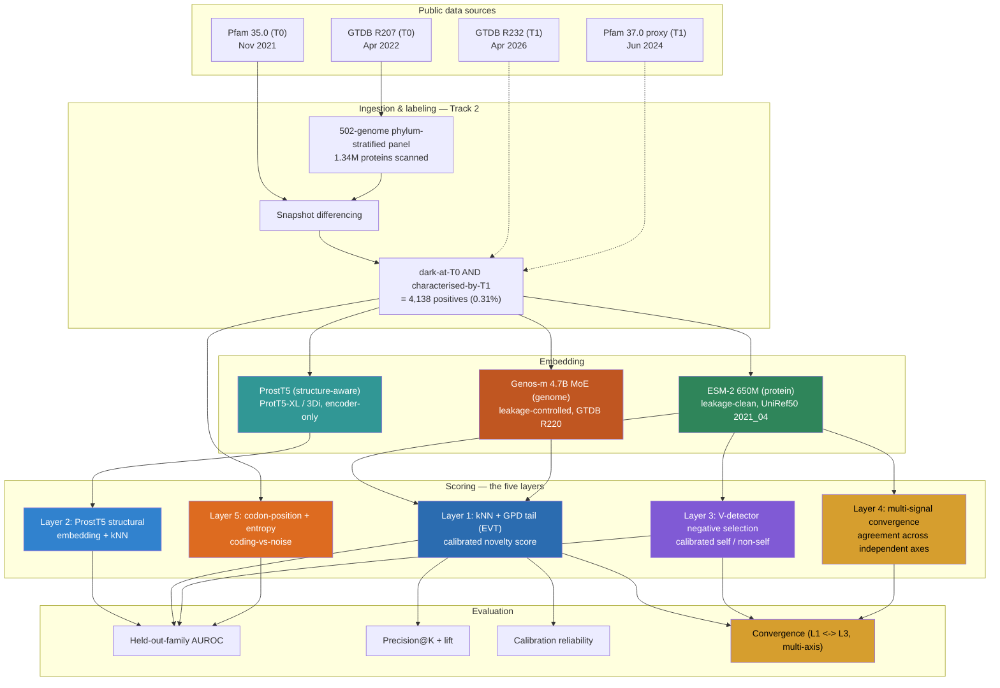

# Obscuron
**Calibrated novelty detection for microbial dark matter, validated retrospectively against real characterisation events.**

[](LICENSE)
[](pyproject.toml)
[](pyproject.toml)
[](docs/problems_and_decisions.md)
[](http://obscuron-site-067620369122.s3-website-us-east-1.amazonaws.com)

**Live project page:** http://obscuron-site-067620369122.s3-website-us-east-1.amazonaws.com
(source: [`web/index.html`](web/index.html); hosted on S3 static website hosting, HTTP only — CloudFront/HTTPS is pending AWS account verification)

---

## What this is

Most sequenced microbial genes have no functional annotation, because annotation is normally assigned by similarity to something already known, and for a huge share of genes nothing similar has ever been characterised. Obscuron scores each such "dark matter" sequence with a calibrated novelty score — an extreme-value-theory (EVT) tail p-value over kNN distance in a protein-language-model embedding — and validates it *retrospectively*: freeze a reference database at an earlier snapshot, score what was dark then, and grade those scores against a later snapshot in which some of those sequences have since been characterised. The headline, full-scale result: **held-out-family AUROC of 0.962 (mean, layer-22 ESM-2 embeddings, 903 Pfam-35 families)** — the scorer reliably separates a withheld protein family from everything else, on real data, at scale.

---

> **Status: the technical work of this 4-phase capstone is closed on both tracks — the benchmark + go/no-go gate, the Layer-1 EVT scorer, the Layer-3 immune self/non-self layer, and the Phase-4 extension covering all five blueprint layers (Layer 2 ProstT5 at full scale, Layer 4 multi-signal convergence with five axes, Layer 5 coding-structure discrimination with a true-intergenic control), plus the full-scale Genos-m comparison and a leakage-tightened re-test of the Genos-m axis. Track 1 declined to re-freeze Layer 3's detector count, so its frozen default stands (P3-D8). Only manuscript proofreading and submission remain. This is research code from a final-year B.Tech capstone (MPSTME, NMIMS Hyderabad) targeting ACM-BCB 2027, not a packaged library.**

---

## Architecture



Three embedding arms (protein, genome, structure-aware) feed five independently-designed layers; the convergence check where independent axes reconverge (Layer 4, plus the Layer-1/Layer-3 check) is what lets one signal cross-validate another without shared assumptions.

---

## The problem

Annotation pipelines assign gene function by similarity search, so a gene with no similar characterised sequence gets no function — and that same absence of a known match means there's no ground truth to check whether a proposed "novelty detector" is even right. In this project's own 502-genome benchmark panel, **297,798 of 1,341,100 scanned proteins (22.21%) had zero hit against Pfam 35.0** at the family gathering threshold. Retrospective validation is the only way to manufacture a falsifiable test for a method that claims to find the interesting cases inside that 22%.

---

## How it works

| Layer / Component | What it does |
|---|---|
| Snapshot differencing | Freezes GTDB R207 + Pfam 35.0 as T0, and grades T0-dark sequences against a Pfam-37 net-new-family signal as a T1 proxy for what's been characterised since. |
| ESM-2 embedding arm | Protein-language-model embeddings (650M params, UniRef50 2021_04 cutoff), the leakage-clean headline because its pretraining predates T0. |
| Genos-m embedding arm | Genomic foundation model (4.7B MoE, nucleotide input), run as a leakage-*controlled* comparison — its GTDB R220 pretraining overlaps the benchmark window, so positives are restricted post-R220 for a clean read. |
| Layer 1 — EVT novelty scorer | kNN cosine distance to the characterised reference, calibrated with a Generalized Pareto tail fit so the output is a checked false-flag-rate p-value, not a raw distance. |
| Layer 3 — immune self/non-self | V-detector negative selection over the same embeddings: a repertoire of detectors covers "non-self" space, calibrated so the held-out-self false-flag rate stays under a target α. |
| Layer 2 — structure-aware embedding | ProstT5 (ProtT5-XL fine-tuned on Foldseek 3Di, encoder-only) gives a structure-informed embedding without full 3-D folding — the light ESMFold substitute — scored with the same held-out-family protocol. |
| Layer 4 — multi-signal convergence | Combines independent novelty axes (Layer-1 EVT + an embedding-free genomic-context axis + a sequence-composition axis) and flags high-confidence novelty only where they agree — the "independent lines converge" principle. |
| Layer 5 — coding-structure statistics | Codon-position base bias + k-mer entropy, tested against shuffled and Markov nulls, to confirm the dark genes carry genuine coding structure rather than being spurious/non-coding artifacts. |
| Evaluation harness | Held-out-family AUROC, retrospective Precision@K + lift, and a calibration reliability check — the three metrics frozen before any scorer ran — plus the Layer-1/Layer-3 convergence check and the Layer-4 multi-axis convergence. |

---

## Results

### 1. The retrospective benchmark clears its go/no-go gate

| Metric | Value |
|---|---|
| Proteins scanned | 1,341,100 |
| Dark-at-T0 | 297,798 (22.21%) |
| Positive-proxy (dark → later characterised) | 4,138 (0.309%) |
| Go/no-go floor (pre-registered) | 50–100 positives |
| Margin over floor | 41–83× |

> **Honest scope:** "characterised by T1" is a Pfam-37 net-new-family proxy, not a full InterProScan run against InterPro-latest as the original design spec called for — narrower coverage, so this count is a floor, not the true number. Details: [`docs/problems_and_decisions.md` § P1-D8](docs/problems_and_decisions.md).

### 2. Layer 1 calibrated novelty scorer — 0.962 held-out-family AUROC at full scale

| Representation | AUROC (mean) | AUROC (median) | Families |
|---|---|---|---|
| Last hidden layer (raw) | 0.786 | 0.815 | 903 |
| Layer 22 (raw) | **0.962** | **0.985** | 903 |

GPD tail fit: ξ = 0.0998, β = 0.00586, KS goodness-of-fit p = 0.984.


> **Honest scope:** Precision@K lift is *below* 1 at every K tested (0.0× at K=50/100, 0.23× at K=500, 0.50× at K=1000) — this is an expected inversion, not a bug. Positives are near-known genes with intentionally *low* novelty scores, so novelty rank anti-predicts near-term characterisation. Held-out-family AUROC is the certified validation metric; Precision@K is a reported field-level finding, not a pass/fail check. Details: [`docs/problems_and_decisions.md` § P2-D6](docs/problems_and_decisions.md).

### 3. Genome-vs-protein comparison — done at full scale, ESM-2 clearly leads

Run on AWS (A10G) over the real 502-genome nucleotide panel — both a matched 300-family comparison against ESM-2, and the full 903-family eval on its own:

| Model | Matched 300-family AUROC (mean / median) | Full 903-family AUROC (mean / median) |
|---|---|---|
| ESM-2 layer 22 (protein) | **0.988 / 0.996** | **0.962 / 0.985** |
| Genos-m layer 9 (genome) | 0.739 / 0.795 | 0.665 / 0.703 |

The genomic FM is a real signal (well above chance) but a distinctly weaker detector — and since Genos-m is the *leakage-controlled* arm (its GTDB R220 pretraining overlaps the benchmark window), it underperforms the leakage-clean protein FM even with a potential leakage advantage, so the ESM-2 headline is not a leakage artifact. A cross-model consistency also emerges: a mid-late layer beats the last layer for *both* models. Note the full-scale numbers are meaningfully lower than the matched-300 ones for both models — family-capping systematically inflates AUROC (more reference members per fold, no small/rare families dragging the average down), so **the 903-family column is the reportable headline, the 300-family column is the fair apples-to-apples comparison.**

> **Honest scope:** the 300-family cap was originally used for a reasonable cloud runtime; the full 903-family Genos-m eval has since been run (2026-09-14, ~75 min on a `g5.xlarge`, ~$1.25). Details: [`docs/problems_and_decisions.md` § P2-D11, P4-D8](docs/problems_and_decisions.md).

### 4. Layer 3 immune self/non-self — calibration holds, moderate convergence with Layer 1

| Metric (α = 0.05, 5,000 detectors, PCA-50) | Value |
|---|---|
| Held-out-self flag rate (target ≤ 0.05) | 0.023 |
| Held-out-family AUROC (60 families, original build) | 0.62 mean / 0.53 median |
| Held-out-family AUROC (swept to 20,000 detectors) | 0.86 mean |
| Held-out-family AUROC (measured saturation, ~30,000+ detectors) | 0.89 mean (plateau) |
| Full-scale convergence with Layer 1 (14,138 real dark queries) | Spearman ρ = 0.485 |
| Full-scale non-self flag rate | 11.9% of dark queries — 20.1% of eventual positives vs. 8.6% of still-dark |


> **Honest scope:** as a standalone detector, Layer 3 stays below Layer 1 even at its measured ceiling (0.89 vs. 0.962) — it was designed to *corroborate* Layer 1 via an independently-derived signal, not to beat it. The frozen production config (5,000 detectors) sits at 0.74, below what more detectors would buy. Track 1 reviewed that headroom and **declined to re-freeze**, so the frozen default stands and the paper reports 0.74 as the as-shipped number with 0.89 as a sensitivity result. Details: [`docs/problems_and_decisions.md` § P3-D6, P3-D7, P3-D8](docs/problems_and_decisions.md).

### 5. Layer 4 multi-signal convergence — independent axes agree beyond chance, with two reported-but-not-promoted exceptions

Five novelty axes of different kinds — Layer-1 EVT embedding novelty, an embedding-free genomic-context novelty, a sequence-composition novelty, and (added 2026-09-14) Genos-m's and ProstT5's own kNN novelty — combined so a gene is high-confidence novel only where they agree.

| Axis pair | Spearman | Reading |
|---|---|---|
| EVT ~ genomic-context | −0.05 | independent |
| genomic-context ~ composition | +0.01 | independent |
| EVT ~ composition | +0.26 | moderate (ESM-2 encodes some composition) |
| EVT ~ genos-m | +0.15 | weak-moderate |
| genomic-context ~ genos-m | −0.05 | independent |
| composition ~ genos-m | −0.32 | moderate, negative |
| EVT ~ ProstT5 | +0.15 | weak-moderate |
| genomic-context ~ ProstT5 | +0.06 | independent |
| composition ~ ProstT5 | **+0.64** | **not independent** (restates composition) |
| genos-m ~ ProstT5 | −0.43 | moderate, negative |

The first three axes are largely independent, so their convergence is genuine multi-evidence, not one signal restated. The 3-way convergent set is **108 genes = 3.4× more than chance would give** under independence, and evt/context/composition all *deplete* the near-known positives (lifts 1.00×/0.68×/0.26×) — consistent with novelty anti-predicting near-term characterisation.

**Genos-m breaks that pattern: its top-10% novelty *enriches* for positives (lift 1.30×)** — the only axis in the whole project that points this direction.

> **Honest scope, not a 4th independent line of evidence:** Genos-m's pretraining saw GTDB R220, which sits inside this benchmark's T0→T1 window — the same leakage this project controls for everywhere else (P1-D7). Leakage is the leading explanation for the 1.30× lift, so the axis is reported with a caveat, not folded into the "independent lines converge" story. **A direct test (P4-D11) did not confirm it:** re-scoring under the tightest boundary the Pfam releases allow (Pfam 36→37, 2,448 positives full-panel) shrank the positive set 43% but only moved the Genos-m lift from 1.32× to 1.26×, so leakage stays a leading, unconfirmed hypothesis rather than an established cause. The 4-way convergent set (n=35, lift 0.94×) reads close to neutral because Genos-m's enrichment partially cancels the other three axes' depletion.
>
> **ProstT5 as a 5th axis is not independent of composition** (ρ = +0.64) and depletes positives in the same direction (lift 0.28×); the 5-way set is 20 genes at 1.24×. It is reported for completeness, not promoted over the 3-axis headline. Details: [`docs/problems_and_decisions.md` § P4-D1/D2/D4/D8/D10/D11](docs/problems_and_decisions.md).


### 6. Layer 5 coding-structure — the dark genes are genuinely coding

Codon-position base bias + k-mer entropy on all 34,138 dark genes, tested against each gene's own shuffled and Markov-1 nulls:

| Signal | Value |
|---|---|
| Codon-position base bias (median: real / shuffle / Markov-1) | 0.072 / 0.011 / 0.011 |
| **Coding-vs-noise AUROC** (real vs shuffle / vs Markov-1) | **0.94 / 0.94** |

The dark matter carries genuine reading-frame structure, i.e. these are real ORFs and not spurious calls — a direct answer to the non-coding-artifact risk, and evidence the benchmark rests on real coding sequences.


**True-intergenic control (P4-D9):** streaming real genome assemblies and extracting the sequence between gene calls (44 panel genomes, 81,286 segments) gives a harder, more realistic negative than the artificial nulls: intergenic codon-position bias has median 0.031 (vs 0.011 for shuffle/Markov-1), and coding-vs-true-intergenic AUROC is **0.78**. That is the more trustworthy number to quote; 0.94 is against artificial nulls.

> **Honest scope:** the intergenic control covers 44 of 502 panel genomes (a bounded-cost sample), not the full panel. Details: [`docs/problems_and_decisions.md` § P4-D5, P4-D9](docs/problems_and_decisions.md).

### 7. Layer 2 structure-aware embedding (ProstT5) — strong, just below the sequence LM

ProstT5's structure-informed encoder, scored with the same held-out-family protocol on the 300 largest families (6,907 proteins, matched to the ESM-2/Genos-m comparison; an earlier 60-family pilot read slightly higher, 0.960 / 0.972, the same family-capping inflation seen in the other two arms):

| Model (same 300 families) | Held-out-family AUROC (mean / median) |
|---|---|
| ESM-2 layer 22 (sequence) | 0.988 / 0.996 |
| **ProstT5 centered (structure)** | **0.944 / 0.960** |
| Genos-m layer 9 (genome) | 0.739 / 0.795 |

Structure-aware embedding is a strong Pfam-family separator, just below the pure sequence LM and well above the genomic FM — sensible, since Pfam families are homology-defined so a sequence model is naturally strong; structure is complementary, not superior, for family separation.


> **Honest scope:** reported at the matched 300-family scale, not the full 903-family panel that the ESM-2 headline uses. ProstT5 was also embedded for all 34,138 dark queries to serve as Layer 4's 5th axis. Details: [`docs/problems_and_decisions.md` § P4-D6, P4-D10](docs/problems_and_decisions.md).

---

## Honest limitations

- The T1 "characterised" signal is a Pfam-37 net-new-family proxy, not full InterProScan against InterPro-latest — narrower than the original design spec, so the true positive count is understated, not overstated.
- Genos-m has both a full 903-family eval and a matched 300-family comparison against ESM-2 (both cloud A10G runs); ProstT5 (Layer 2) is reported at the matched 300-family scale, not the full 903-family scale of the ESM-2 headline.
- Genos-m's leakage exposure is only partially controllable: the leakage-tightened re-test (P4-D11) barely moved its enrichment, and no Pfam release beyond 37.0 exists here to test a genuinely clean post-cutoff split, so leakage remains an unconfirmed hypothesis for that axis.
- The retrospective positive set is selection-biased toward near-known genes (characterisation is homology-driven), so Precision@K measures prioritisation value, not "novelty equals characterisability" — stated explicitly, not smoothed over.
- Layer 3 (immune) underperforms Layer 1 as a standalone detector at every detector count tested up to 50,000 (0.89 at its plateau vs 0.962); it's reported as a corroborating signal, not a competing one, and its frozen 5,000-detector default was deliberately kept.
- The full-scale dark-query flagging result uses a stratified 14,138-of-34,138 sample of the dark-query population (all positives, 33% of dark_negatives) — a compute-time scope decision, not a methods one.
- No CI pipeline and minimal automated tests (two smoke/device tests in `tests/`) — correctness is currently established by manual runs logged in `docs/experiment_log.md`, not an automated suite.
- Layer 5's true-intergenic control covers 44 of the 502 panel genomes (a bounded-cost sample), not the full panel; the 0.94 figure against shuffled/Markov-1 nulls is the easier of the two numbers.
- No wet-lab or independent biological validation of any flagged sequence — every result here is a computational prioritisation signal, not a functional claim.
- Developed and run on two personal machines (an M1 Pro laptop and an RTX 4060 laptop, 8GB VRAM), not a reproducible cloud environment — hardware-specific workarounds (fp32-only on MPS, small batch sizes) are documented but not eliminated.

---

## Repository structure

```
Obscuron/
├── src/darkmatter/          # canonical package
│   ├── data/                 # GTDB/Pfam ingestion, snapshot differencing, panel building
│   ├── embeddings/           # ESM-2, Genos-m, and ProstT5 (Layer 2) embedder backends
│   ├── scoring/               # Layer 1: kNN distance + GPD tail (EVT) novelty scorer
│   ├── immune/                # Layer 3: V-detector negative selection
│   ├── convergence/           # Layer 4: genomic-context + composition novelty, multi-axis convergence
│   ├── statistical/           # Layer 5: codon-position bias + k-mer entropy coding-structure stats
│   └── analysis/              # figure generation for the evaluation harness
├── scripts/                  # CLI entry points: fetch, embed, score, evaluate, sweep, convergence, layer2/5
├── config/                   # frozen hyperparameters (snapshots, scorer, immune, convergence, statistical, models .yaml)
├── tests/                    # pytest: device detection + embedding smoke tests
├── docs/                     # design docs, decision log, experiment log, reproducibility notes
├── results/                  # committed derived artifacts: CSVs, JSON summaries, figures
├── benchmark_release/         # standalone benchmark package: README, checksummed manifest, genome panel, protein labels
├── paper_draft/               # manuscript drafts (gitignored — work in progress)
├── web/                       # project landing page (index.html), deployed to S3 — see Live project page above
├── data/                      # gitignored — snapshots, sequences, embeddings (built locally)
├── figures/                   # gitignored — scratch evaluation output
├── pyproject.toml             # uv-managed dependencies (Python 3.11+)
└── uv.lock
```

---

## Quick start

The fastest path to seeing the core pipeline load, no cloud account and no GPU required:

```bash
git clone https://github.com/Ganglet/Obscuron.git
cd Obscuron
uv sync
uv run python scripts/smoke_test.py --skip-genos-m   # ESM-2 only — verifies the backend loads and embeds
```

---

## Reproduce everything else

```bash
# Fetch reference-database metadata (no cloud account needed)
uv run python scripts/fetch_snapshot.py --source gtdb --release R232 --metadata-only
```

```bash
# Build the benchmark panel (Track 1's frozen sampling spec, config/snapshots.yaml)
uv run python scripts/build_genome_panel.py
uv run python scripts/extract_panel_proteins.py
uv run python scripts/label_panel_proteins.py
uv run python scripts/build_embedding_sample.py
```

```bash
# Embed both arms (ESM-2 fits comfortably in 8GB VRAM; Genos-m needs ~9GB unquantized)
uv run python scripts/embed_panel_sample.py --model esm2
uv run python scripts/embed_panel_sample.py --model genos-m   # M1 Pro / 16GB+ recommended
```

```bash
# Layer 1: fit and evaluate the calibrated novelty scorer
uv run python scripts/evaluate_scorer.py --arm esm2 --config config/scorer.yaml
uv run python scripts/heldout_family_eval.py --arm esm2 --config config/scorer.yaml
```

```bash
# Layer 3: re-embed at the validated layer, build the immune detector, run the full sweep
uv run python scripts/reembed_reference_immune.py --layers 33,22 --fp32
uv run python scripts/reembed_dark_queries.py --layers 33,22 --fp32
uv run python scripts/run_immune.py
uv run python scripts/immune_sweep.py
uv run python scripts/immune_detector_saturation.py
```

```bash
# Layers 2, 4, 5 and the Phase 4 follow-ups
uv run python scripts/run_layer2_prostt5.py            # Layer 2: ProstT5 structure-aware arm
uv run python scripts/compute_composition_novelty.py   # Layer 4 composition axis
uv run python scripts/run_convergence.py               # Layer 4: multi-axis convergence
uv run python scripts/run_statistical.py               # Layer 5: coding-structure statistics
uv run python scripts/extract_intergenic_controls.py   # Layer 5: true-intergenic control
uv run python scripts/label_panel_proteins_36_37.py    # leakage-tightened 36->37 boundary (P4-D11)
uv run python scripts/genosm_leakage_relift.py         # Genos-m lift under that boundary
uv run python scripts/package_benchmark_release.py     # standalone benchmark release
```

---

## Data & cost hygiene

The pipeline itself doesn't run live infrastructure, so its operational risk is cloud storage cost, not uptime. **The standing rule (P1-D4): stream public data through the pipeline and persist only derived artifacts — embeddings, labels, manifests — never warehouse the raw GTDB/Pfam downloads.** (The one exception is the project's own static site — see [Live project page](#obscuron) above — a low-cost, low-risk S3-hosted page, not a data-processing dependency.)

> Born from a real bill: an earlier iteration staged the full GTDB R207 protein FASTA set on S3 and racked up roughly $12 over 3 months for ~166GB of duplicated, freely re-downloadable data. If any S3 staging is used for a one-off run, apply a 30–60 day lifecycle expiry:
> ```bash
> aws s3api put-bucket-lifecycle-configuration --bucket <bucket> \
>   --lifecycle-configuration '{"Rules":[{"Expiration":{"Days":30},"Status":"Enabled"}]}'
> ```

The Genos-m comparison used a rented cloud GPU (AWS A10G): the 300-family matched run, then the full 903-family eval plus Genos-m as a 4th convergence axis on 2026-09-14 (~75 min, ~$1.25). ProstT5's full-scale run and the 36→37 boundary scan ran locally. No paid-compute item remains.

---

## Roadmap

| Phase | Weeks | Track 1 (design / analysis) | Track 2 (implementation) |
|---|---|---|---|
| 1 — Benchmark + go/no-go gate | 1–3 | ✅ Complete | ✅ Complete |
| 2 — Layer 1 EVT scorer | 4–6 | ✅ Complete | ✅ Complete |
| 3 — Layer 3 immune layer | 7–9 | ✅ Complete | ✅ Complete |
| 4 — Extension + manuscript | 10–12 | ✅ Extension complete (Layers 2, 4, 5 built; robustness + full Genos-m comparison; lit-search re-run) · Layer 3 re-freeze declined (P3-D8) · 🔄 manuscript submission | ✅ Figures, README, citations, ProstT5 full scale, intergenic control, benchmark release, Genos-m leakage re-test, project page |

---

## Authors

- **Rayyan Mohammed** — Track 2: implementation & experimental execution. Ingestion/snapshot-differencing pipeline, embedding extraction, EVT scorer implementation, immune-layer sweep and full-scale flagging infrastructure, reproducibility tooling.
- **Angshuman Chakravertty** — Track 1: methodology, design & analysis. Snapshot boundary and provenance standards, EVT/GPD scorer design, immune self/non-self layer design and build, second-boundary robustness check, the within-eval genome-vs-protein comparison, Layer 4 multi-signal convergence, Layer 5 coding-structure discrimination, the Layer 2 ProstT5 structure-aware arm, the pre-submission literature-search re-run, and manuscript authoring.

---

## Documentation index

- [`docs/problems_and_decisions.md`](docs/problems_and_decisions.md) — full numbered decision log, every design choice and result
- [`docs/Track1_phase1_benchmark_scope.md`](docs/Track1_phase1_benchmark_scope.md) — Phase 1 working record
- [`docs/Track1_phase2_scorer_design.md`](docs/Track1_phase2_scorer_design.md) — Layer 1 EVT scorer design spec
- [`docs/Track1_phase3_immune_design.md`](docs/Track1_phase3_immune_design.md) — Layer 3 immune design spec and cross-track hand-offs
- [`docs/Track1_phase4_extension_design.md`](docs/Track1_phase4_extension_design.md) — Phase 4 extension: Layer 4 convergence (+ Layers 2 & 5) design and results
- [`docs/Track2_Phase1_Execution.md`](docs/Track2_Phase1_Execution.md) — Track 2's Phase 1 execution notes
- [`docs/Track2_Phase2_Execution.md`](docs/Track2_Phase2_Execution.md) — Track 2's Phase 2 execution notes
- [`docs/Track2_Phase2_scoring_handoff.md`](docs/Track2_Phase2_scoring_handoff.md) — scorer implementation interface contract
- [`docs/Track2_Phase3_Execution.md`](docs/Track2_Phase3_Execution.md) — Track 2's Phase 3 execution notes (immune sweeps, detector saturation)
- [`docs/Track2_Phase4_Execution.md`](docs/Track2_Phase4_Execution.md) — Track 2's Phase 4 execution notes (Genos-m full eval, ProstT5, intergenic controls, benchmark release)
- [`docs/experiment_log.md`](docs/experiment_log.md) — one dated entry per meaningful run
- [`docs/reproducibility.md`](docs/reproducibility.md) — hardware findings and dataset provenance

---

## License

MIT — see [`LICENSE`](LICENSE). Reference materials and external tools are credited in [`ACKNOWLEDGEMENTS.md`](ACKNOWLEDGEMENTS.md).
